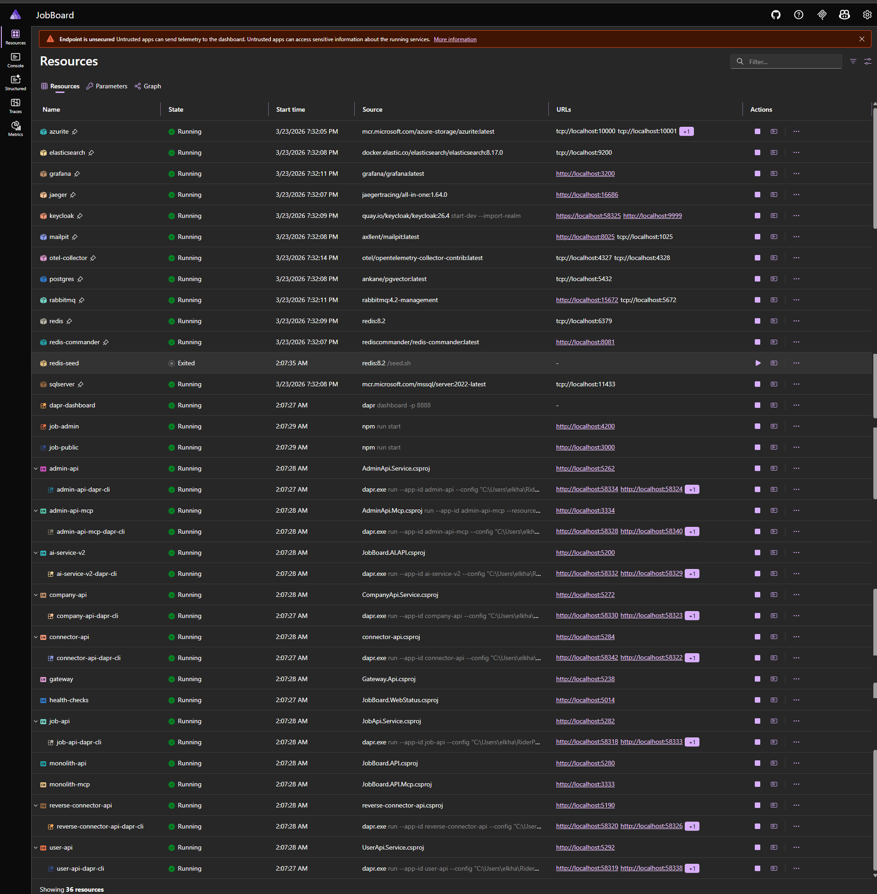
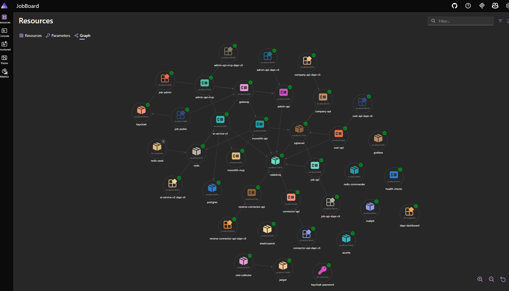

# Job Board Platform (Portfolio)

A **distributed Job Board platform** built to showcase modern backend architecture, event-driven workflows, AI integration, and production-grade observability.

This repository demonstrates **three architectural evolution paths side-by-side**:

1. **Monolith API** (.NET 9) -- Clean Architecture + DDD + CQRS
2. **Microservices** (.NET 9) -- service-per-bounded-context (FastEndpoints)
3. **Strangler-Fig transition layer** via **Connector API** + **Reverse Connector API** (bidirectional incremental migration)

Additional services:

- **AI Service v2** (.NET 10) -- LLM-powered chat, resume parsing, embedding pipeline (RAG), multi-provider function calling
- **Gateway** (.NET 9) -- YARP reverse proxy routing to all backend services
- **MCP Servers** -- Model Context Protocol endpoints for monolith and admin-api

Architectural decisions are documented explicitly using **Architecture Decision Records (ADRs)** to capture trade-offs, constraints, and rationale.

ADR Index: [`docs/ADRs`](./ADRs)

---

## Table of Contents

- [What you can do in the system](#what-you-can-do-in-the-system)
- [Architecture at a glance](#architecture-at-a-glance)
- [Key patterns](#key-patterns)
- [AI and LLM integration](#ai-and-llm-integration)
- [Authentication](#authentication)
- [Observability](#observability)
- [Health checks](#health-checks)
- [Code quality](#code-quality)
- [Running locally](#running-locally)
- [Further reading](#further-reading)
- [Architecture Decision Records](#architecture-decision-records)
- [Screenshots](#screenshots)
- [Roadmap](#roadmap)
- [Notes](#notes)

---

## What you can do in the system

- Create and manage **companies**, **jobs**, and related workflows
- Provision company users via Keycloak with group-based RBAC
- Upload resumes and have them **parsed by AI, embedded into pgvector, and matched against jobs** (RAG)
- Use **AI Chat** with scoped tool access (Admin, Company Admin, Public) powered by MCP servers
- Generate and rewrite job descriptions using multi-provider LLM support (OpenAI, Azure OpenAI, Claude, Gemini)
- Trigger asynchronous workflows via pub/sub and trace them **end-to-end** across all services
- Switch between monolith and microservices mode **per-session** via a toolbar toggle -- each visitor independently experiences both architectures and compares traces
- **Contact form** on the landing page with Exchange Online SMTP, Cloudflare Turnstile captcha, server-side rate limiting, and feature flag control

---

## Architecture at a glance

**Frontends**
- **Admin UI** (Angular 20) -- SPA calling either the Monolith API or Admin API via mode toggle
- **Public UI** (Angular 21 + SSR + Tailwind v4) -- Job-seeker facing application with Keycloak authentication
- **Landing Page** (Next.js 15) -- Portfolio site with contact form, Cloudflare Turnstile captcha, and feature-flagged visibility

**APIs**
- **Monolith API** -- primary application for the monolith path
- **Connector API** -- strangler layer coordinating monolith and services
- **Reverse Connector API** -- bidirectional sync from microservices back to monolith
- **Admin / Company / Job / User APIs** -- microservice bounded contexts
- **AI Service v2** -- LLM chat, resume parsing, embedding pipeline
- **Gateway** -- YARP reverse proxy unifying all backend services

**MCP Servers**
- **Monolith MCP** -- Model Context Protocol endpoint exposing monolith tools
- **Admin API MCP** -- Model Context Protocol endpoint exposing admin-api tools

**Infrastructure**
- **SQL Server** -- transactional persistence (monolith + microservices)
- **PostgreSQL + pgvector** -- vector embeddings for resume matching
- **RabbitMQ** -- local pub/sub with topics and DLQs
- **Redis** -- state store, configuration, feature flags
- **Keycloak** -- identity provider with group-based RBAC
- **Dapr** -- config, secrets, pub/sub, state, service invocation (local/homelab)
- **OpenTelemetry + Jaeger + Grafana + Faro RUM** -- end-to-end distributed tracing across all three frontends, gateway, microservices, and backend, with visitor geo, web vitals, and a unified Find-by-TraceId workflow
- **Grafana Alloy** -- Faro receiver + Loki-to-OTel bridge consolidating frontend telemetry into the OTel pipeline
- **.NET Aspire** -- local orchestration of the full distributed system

Rationale:
- Architecture scope: [ADR-001](./ADRs/ADR-001-Architecture-Showcase-Scope.md)
- Messaging choice: [ADR-006](./ADRs/ADR-006-RabbitMQ-vs-Azure-Service-Bus.md)
- Gateway: [ADR-008](./ADRs/ADR-008-YARP-Gateway-Direct-Proxy.md)
- Docker topology: [ADR-018](./ADRs/ADR-018-Docker-Deployment-Topology.md)

---

## Key patterns

### Clean Architecture + DDD

- Explicit domain model with factory methods and invariants
- Value Objects return `Result<T>` instead of throwing -- validation errors accumulate
- Application layer with use-case handlers separated into Commands and Queries
- Infrastructure isolated behind interfaces

Rationale: [ADR-001](./ADRs/ADR-001-Architecture-Showcase-Scope.md)

---

### CQRS + Custom Decorator Pipeline

Commands and queries are processed through a **decorator chain** (not MediatR):

1. **UserContext** -- auth check + user sync
2. **Observability** -- logging, metrics, OpenTelemetry spans
3. **Validation** -- FluentValidation rules
4. **Transaction** -- DB transaction (skip with `INoTransaction` marker)
5. **ExceptionHandling** -- converts domain exceptions to validation failures
6. **Core handler** -- business logic

Handlers are auto-registered via Scrutor scanning.

Rationale: [ADR-005](./ADRs/ADR-005-CQRS-and-Decorator-Pipeline.md)

---

### Transactional Outbox

Integration events are written transactionally alongside state changes and published asynchronously. The outbox processor uses `UPDLOCK, READPAST` locking, retries up to 3 times, and moves failures to a dead-letter table. Trace context (`TraceParent`) is preserved for full async correlation.

Rationale: [ADR-003](./ADRs/ADR-003-Transactional-Outbox.md)

---

### Strangler-Fig Migration (Bidirectional)

The system supports **incremental, bidirectional migration** between monolith and microservices:

- **Connector API** -- extracts capabilities from monolith to microservices, including a `CompanyProvisioningSaga` that fans out to 3 services in parallel
- **Reverse Connector API** -- syncs changes from microservices back to the monolith to maintain consistency during the migration period
- No big-bang rewrite; monolith remains fully operational

Rationale:
- Migration strategy: [ADR-011](./ADRs/ADR-011-Strangler-Fig-Connector-API-Provisioning-Sagas.md)
- Bidirectional sync: [ADR-012](./ADRs/ADR-012-Reverse-Connector-Bidirectional-Strangler-Fig.md)

---

### Messaging Strategy

- **RabbitMQ** is used locally for fast iteration and DLQ visibility
- **Azure Service Bus** is the cloud target for guaranteed delivery
- Events published as **CloudEvents** via the transactional outbox

Rationale: [ADR-006](./ADRs/ADR-006-RabbitMQ-vs-Azure-Service-Bus.md)

---

### Dapr (Homelab / Local Only)

Dapr is used **intentionally for local parity**, not as a production dependency.

It enables:
- Local emulation of cloud primitives
- Config and secret abstraction
- Event-driven experimentation without cloud lock-in

**Target Azure replacements:**
- Dapr Config --> Azure App Configuration
- Dapr Secrets --> Azure Key Vault
- Dapr Pub/Sub --> Azure Service Bus
- Dapr Invocation --> direct HTTP / Azure SignalR

Rationale: [ADR-002](./ADRs/ADR-002-Dapr-Usage-Boundaries.md)

---

### EF Core Dual-ID Pattern

Entities use `int InternalId` (DB primary key with sequences) + `Guid Id` (public API identifier), generated atomically via SQL Server sequences.

Rationale: [ADR-019](./ADRs/ADR-019-EF-Core-Dual-ID-Sequence-Generation.md)

---

## AI and LLM integration

### Multi-Provider Function Calling

The AI service supports **OpenAI, Azure OpenAI, Claude, and Gemini** with a unified interface. Tool registries are scoped per chat context:

- **System Admin** -- full access including global mode switching (`SetModeTool`)
- **Admin** -- monolith + admin-api MCP tools, system info, draft generation
- **Company Admin** -- company-scoped operations
- **Public** -- job-seeker facing tools

LLM tools are exposed via **MCP (Model Context Protocol)** servers, enabling the AI service to call monolith and admin-api operations as function calls.

The AI service reads the `x-mode` header from each request to resolve the correct MCP tool registry per session -- so each user's chat interacts with whichever architecture (monolith or microservices) they've selected in the toolbar.

Rationale:
- Multi-provider function calling: [ADR-009](./ADRs/ADR-009-AI-Service-Multi-Provider-Function-Calling.md)
- Multi-scope chat: [ADR-016](./ADRs/ADR-016-Multi-Scope-AI-Chat.md)
- MCP integration: [ADR-015](./ADRs/ADR-015-MCP-Server-Integration.md)
- Real-time notifications: [ADR-010](./ADRs/ADR-010-Real-Time-AI-Notifications-SignalR.md)

### Resume Embedding Pipeline (RAG)

A full **Retrieval-Augmented Generation** pipeline:

1. Resume uploaded --> monolith writes outbox event
2. Outbox publishes to RabbitMQ --> Dapr pub/sub delivers to AI service
3. AI service downloads blob, parses resume content via LLM
4. Parsed sections sent back to monolith, embeddings generated (1536-dim)
5. Embeddings stored in **pgvector** with cosine distance for semantic search

Rationale: [ADR-014](./ADRs/ADR-014-Resume-Embedding-Pipeline-RAG.md)

### Shared Integration Events

Event contracts (`ResumeUploadedV1Event`, `ResumeParsedV1Event`, `JobCreatedV1Event`, etc.) are published as a shared **NuGet package** consumed by all services.

Rationale: [ADR-017](./ADRs/ADR-017-IntegrationEvents-Shared-NuGet-Package.md)

---

## Authentication

- **Keycloak** with group-based RBAC: `/SystemAdmins`, `/Admins`, `/Companies/{uid}/CompanyAdmins`, `/Companies/{uid}/Recruiters`, `/Applicants`
- **SystemAdmin** role separates platform owner from portfolio visitors -- visitors log in as Admins but cannot change AI provider, global mode, or trigger re-embedding
- Admin app uses **angular-auth-oidc-client** with PKCE
- Public app uses **angular-auth-oidc-client** with Keycloak (SSR-safe with optional inject pattern)
- Microservice endpoints are `AllowAnonymous()` -- auth enforced at the Gateway
- Service-to-service calls use `InternalApiKey` fallback
- User provisioning creates Keycloak groups, sub-groups, and sends verification emails

Rationale: [ADR-013](./ADRs/ADR-013-Keycloak-Migration-Auth-Strategy.md)

---

### Trace Context Propagation

Trace context is propagated consistently across:
- HTTP calls (frontend --> gateway --> services)
- Async messaging (outbox --> RabbitMQ --> subscribers)
- Background processors (restored from stored `TraceParent`)

This enables full end-to-end traceability from a browser click through every service and back.

Rationale: [ADR-007](./ADRs/ADR-007-Trace-Context-Propagation.md)

---

## Observability

The platform is instrumented **end-to-end** -- from a button click in the browser through the gateway, command pipeline, database, and async workflows -- all correlated by one TraceId.

**One store per signal**
- **Traces** -- Jaeger
- **Logs** -- Elasticsearch (single `fe-logs` index also holds FE spans, see below)
- **Metrics** -- Prometheus (spanmetrics-derived)

**Backend**
- Distributed tracing across APIs, DB, and async workflows
- Serilog structured logs enriched with TraceId / SpanId / ParentSpanId
- OpenTelemetry spans with custom activity tags (user, command, CQRS handler, AI provider/model)
- Logs land in Elasticsearch via Serilog OTel exporter

**Frontend (RUM)**
- Grafana Faro Web SDK in all three frontends (`landing`, `admin-fe`, `public-fe`) -- captures errors, web vitals, navigation, and explicit activity events
- Custom `ActivityLogger` service in both Angular apps wraps `faro.api.pushLog` with structured context (level, geo, trace/span IDs); the `trace<T>` RxJS operator creates an internal "activity X" span that becomes the parent of the downstream HTTP span -- so a `[admin] ai provider update ok` log line, the FE `HTTP PUT` span, the gateway proxy span, and the `UpdateProviderCommand` backend log all share one TraceId
- Angular apps disable Faro's auto fetch/XHR instrumentation -- their `tracingInterceptor` already emits CLIENT spans per `HttpClient` call, so the built-in fetch spans were duplicates. Landing (Next.js) keeps auto-instrumentation on
- Visitor geo (country / city / region / lat / lon) resolved server-side from `cf-ipcountry` + ipapi.co, stamped on every span via a custom `SpanProcessor`, surfaced as filterable Prometheus dimensions and dashboard columns

**Pipeline**
- Browser --> Faro endpoint (Alloy `faro.receiver`) --> OTel Collector --> fan-out:
  - Traces --> Jaeger + spanmetrics --> Prometheus
  - FE traces --> Elasticsearch `fe-logs` (so FE spans appear alongside FE + backend logs in the unified Find by Trace Id view)
  - Logs --> Elasticsearch (backend Serilog exporter + frontend Faro via OTTL transforms that extract logfmt body fields, drop non-log records, and normalize to the Serilog field shape)

**Dashboards**
- *Web App RUM* -- page loads, p95 latency, throughput, error rate by route, top routes, **Recent traces**, **Visitors by city** (geomap)
- *Find by Trace Id* -- one TraceId in, two panels out: distributed trace (Jaeger) + a single unified **Logs** panel (Elasticsearch) that contains backend Serilog docs, frontend `pushLog` docs, AND frontend span docs in one chronological table. A `Kind` column discriminates span rows from log rows. All other dashboards' `TraceId` fields link here via a shared datasource-level `dataLinks` entry

**Access**
- Grafana on the homelab is configured with anonymous Viewer role (no login required) so portfolio visitors can open any dashboard directly. Edit/admin functions remain gated behind real user accounts.

Rationale: [ADR-004](./ADRs/ADR-004-Observability-First.md)

See also: [`observability.md`](./guides/observability.md)

---

## Health checks

A centralized health dashboard exposes:

- Liveness and readiness for all services
- Dependency health: databases, messaging, config stores, secrets, external APIs (OpenAI, Azure OpenAI, Claude, Gemini), Keycloak, Dapr sidecars

Rationale: [ADR-004](./ADRs/ADR-004-Observability-First.md)

See also: [`health-checks.md`](./guides/health-checks.md)

---

## Code quality

### .NET Static Analysis

All C# projects are configured with static analysis via a root-level `Directory.Build.props` and `.editorconfig`:

- **Microsoft.CodeAnalysis.NetAnalyzers** enabled at `latest-recommended` level (auto-maps per TFM)
- **Meziantou.Analyzer** for modern best-practice rules (naming, performance, security)
- **`EnforceCodeStyleInBuild`** ensures code style rules are checked during build
- Code style conventions (var usage, expression-bodied members, file-scoped namespaces, `_camelCase` private fields) documented in `.editorconfig`
- Rule severities tuned for the portfolio context -- noisy rules set to `suggestion`, actionable rules kept as `warning`

```bash
# Format check
dotnet format JobBoard.sln --verify-no-changes

# Auto-fix formatting
dotnet format JobBoard.sln
```

### Angular ESLint

Both frontend apps are configured with ESLint (flat config) + Prettier:

- **job-admin** (Angular 20) -- `angular-eslint` + `typescript-eslint` + `eslint-config-prettier`
- **job-public** (Angular 21) -- same stack, independent config
- Template accessibility rules enabled (`templateAccessibility`)
- PrimeNG/Tailwind a11y false positives set to `warn`

```bash
# Lint
cd apps/job-admin && npm run lint
cd apps/job-public && npm run lint

# Auto-fix
cd apps/job-admin && npm run lint:fix
cd apps/job-public && npm run lint:fix
```

---

## Running locally

### With .NET Aspire (recommended)

The entire platform can be launched with a single command via the Aspire AppHost:

```bash
dotnet run --project aspire/JobBoard.AppHost/JobBoard.AppHost.csproj
```

This orchestrates all 36 resources — services, Dapr sidecars, infrastructure containers, and the observability stack:





See also: [`local-environment.md`](./guides/local-environment.md) | [ADR-020](./ADRs/ADR-020-Aspire-Local-Orchestration.md)

### With Docker Compose

```bash
cd scripts
docker-compose -f docker-compose.dev.yml up -d
```

### Prerequisites

- .NET 9 / .NET 10 SDK
- Docker Desktop
- Node.js 20+ (for Angular apps)
- Keycloak realm configured with group mappers and audience mapper

### API Keys (User Secrets)

The AI service requires API keys for LLM providers. These are stored using **.NET User Secrets** (never committed to source control):

```bash
cd services/ai-service.v2/Src/Presentation/JobBoard.AI.API

dotnet user-secrets set "AI:OPENAI_API_KEY" "sk-..."
dotnet user-secrets set "AI:OPENAI_MODEL" "gpt-4.1-mini"
dotnet user-secrets set "AI:AZURE_API_KEY" "your-azure-openai-key"
dotnet user-secrets set "AI:AZURE_API_Endpoint" "https://your-resource.openai.azure.com"
dotnet user-secrets set "AI:AZURE_OPENAI_MODEL" "gpt-4o-mini"
dotnet user-secrets set "AI:CLAUDE_API_KEY" "sk-ant-..."
dotnet user-secrets set "AI:GEMINI_API_KEY" "your-gemini-key"
dotnet user-secrets set "AI:GEMINI_MODEL" "gemini-2.0-flash-lite"
```

Only the provider you intend to use needs to be configured. The active provider is controlled by the `AIProvider` config key (set via Redis seed or Dapr config).

Rationale: [ADR-002](./ADRs/ADR-002-Dapr-Usage-Boundaries.md)

---

## Further reading

| Document | Description |
|----------|-------------|
| [`guides/local-environment.md`](./guides/local-environment.md) | Local development setup, Aspire orchestration, configuration sources, Azure mapping |
| [`ai-service.md`](./ai-service.md) | AI service architecture: chat flow, multi-provider LLM, MCP integration, resume pipeline (RAG) |
| [`guides/observability.md`](./guides/observability.md) | Distributed tracing, log correlation, Grafana/Jaeger workflows |
| [`guides/strangler-fig.md`](./guides/strangler-fig.md) | Strangler-fig migration strategy, saga flow, stage diagrams |
| [`guides/health-checks.md`](./guides/health-checks.md) | Health check dashboard, dependency monitoring |
| [`guides/screenshots.md`](./guides/screenshots.md) | Curated UI and infrastructure screenshots |

---

## Architecture Decision Records

All significant architectural decisions are documented as ADRs:

- [ADR-001 -- Architecture Showcase Scope](./ADRs/ADR-001-Architecture-Showcase-Scope.md)
- [ADR-002 -- Dapr Usage Boundaries](./ADRs/ADR-002-Dapr-Usage-Boundaries.md)
- [ADR-003 -- Transactional Outbox](./ADRs/ADR-003-Transactional-Outbox.md)
- [ADR-004 -- Observability First](./ADRs/ADR-004-Observability-First.md)
- [ADR-005 -- CQRS and Decorator Pipeline](./ADRs/ADR-005-CQRS-and-Decorator-Pipeline.md)
- [ADR-006 -- RabbitMQ vs Azure Service Bus](./ADRs/ADR-006-RabbitMQ-vs-Azure-Service-Bus.md)
- [ADR-007 -- Trace Context Propagation](./ADRs/ADR-007-Trace-Context-Propagation.md)
- [ADR-008 -- YARP Gateway Direct Proxy](./ADRs/ADR-008-YARP-Gateway-Direct-Proxy.md)
- [ADR-009 -- AI Service Multi-Provider Function Calling](./ADRs/ADR-009-AI-Service-Multi-Provider-Function-Calling.md)
- [ADR-010 -- Real-Time AI Notifications SignalR](./ADRs/ADR-010-Real-Time-AI-Notifications-SignalR.md)
- [ADR-011 -- Strangler-Fig Connector API Provisioning Sagas](./ADRs/ADR-011-Strangler-Fig-Connector-API-Provisioning-Sagas.md)
- [ADR-012 -- Reverse Connector Bidirectional Strangler-Fig](./ADRs/ADR-012-Reverse-Connector-Bidirectional-Strangler-Fig.md)
- [ADR-013 -- Keycloak Migration Auth Strategy](./ADRs/ADR-013-Keycloak-Migration-Auth-Strategy.md)
- [ADR-014 -- Resume Embedding Pipeline (RAG)](./ADRs/ADR-014-Resume-Embedding-Pipeline-RAG.md)
- [ADR-015 -- MCP Server Integration](./ADRs/ADR-015-MCP-Server-Integration.md)
- [ADR-016 -- Multi-Scope AI Chat](./ADRs/ADR-016-Multi-Scope-AI-Chat.md)
- [ADR-017 -- IntegrationEvents Shared NuGet Package](./ADRs/ADR-017-IntegrationEvents-Shared-NuGet-Package.md)
- [ADR-018 -- Docker Deployment Topology](./ADRs/ADR-018-Docker-Deployment-Topology.md)
- [ADR-019 -- EF Core Dual-ID Sequence Generation](./ADRs/ADR-019-EF-Core-Dual-ID-Sequence-Generation.md)
- [ADR-020 -- Aspire Local Orchestration](./ADRs/ADR-020-Aspire-Local-Orchestration.md)

---

## Screenshots

Curated screenshots live under `Images/`:

- `Images/Observability/`
- `Images/Strangler Fig/`
- `Images/Http/`
- `Images/healthchecks/`

See: [`screenshots.md`](./guides/screenshots.md)

---

## Azure Deployment

The platform deploys to **Azure Container Apps** via **Bicep IaC** and **GitHub Actions CI/CD**.

### Azure Resources

| Resource | Service |
|----------|---------|
| Azure Container Apps (Consumption) | 16 containerized services, scale-to-zero |
| Azure SQL Database (Serverless) | 2 databases with auto-pause |
| Azure Database for PostgreSQL | pgvector for embeddings |
| Azure Cache for Redis | State store + caching |
| Azure App Configuration (Free) | Feature flags + per-service config |
| Azure Key Vault | Secrets management |
| Azure Container Registry | Docker image storage |
| Azure Monitor + Log Analytics | Observability |
| RabbitMQ (Container App) | Pub/sub messaging |
| Keycloak (Container App) | Identity provider |

### Deploy / Teardown

Deploy is fully automated via GitHub Actions (`workflow_dispatch`):

```bash
# Teardown (deletes everything)
az group delete -n rg-portfolio-jobboard --yes --no-wait
```

Re-deployment recreates the entire infrastructure from scratch in ~10 minutes.

### Dual Environment

The same codebase runs on both **Azure** and **Proxmox homelab** without code changes:
- **Azure**: Dapr components use Azure App Configuration, Key Vault, and Azure Redis
- **Homelab**: Dapr components use Redis config stores, HashiCorp Vault, and local Redis
- **Cloudflare Tunnel** exposes the homelab to the internet -- a `cloudflared` container creates an outbound-only encrypted connection to Cloudflare's edge, with no open ports or port forwarding required
- A **declarative config file** (`deploy/cloudflare/tunnel-config.json`) controls which services are publicly accessible
- A **GitHub Action** (`cloudflare-tunnel.yml`) syncs tunnel ingress rules and DNS CNAME records from the config file via the Cloudflare API

### IaC Structure

```
deploy/
  main.bicep               # Orchestrator (phased deployment)
  main.bicepparam           # Environment parameters
  modules/
    log-analytics.bicep     # Azure Monitor workspace
    key-vault.bicep         # Secrets
    container-registry.bicep
    storage-account.bicep   # Blob storage (resumes)
    managed-identity.bicep  # RBAC role assignments
    sql-server.bicep        # Serverless SQL (2 DBs, auto-pause)
    postgresql.bicep        # pgvector + Keycloak DB
    redis.bicep             # State + cache
    app-configuration.bicep # Feature flags
    container-apps-env.bicep # ACA Environment + 17 Dapr components
    container-app.bicep     # Reusable Container App module
    keycloak.bicep           # Keycloak with PostgreSQL backend
  scripts/
    seed-keyvault.sh        # Populate secrets
  cloudflare/
    tunnel-config.json      # Declarative list of public hostnames
```

See: `.github/workflows/deploy.yml` | `.github/workflows/cloudflare-tunnel.yml`

---

## Roadmap

- ~~Automate Cloudflare DNS updates in CI/CD pipeline~~ (`cloudflare-tunnel.yml`)
- ~~Public app: job search, application flow, resume management UI~~
- ~~Feature flag management (Redis/SignalR, admin settings page, public chat toggle)~~
- ~~Public chat AI tools — 4 tools (job matching, semantic search, similar jobs, job detail)~~
- ~~Applications pipeline & reviews — Kanban board, AI match scoring, batch operations~~
- ~~Microservices observability — TracingMiddleware across all 4 services, per-endpoint domain tags~~
- ~~In-app guided tour — guided overlay, "How to Explore" drawer, architecture popups with Mermaid diagrams~~
- ~~Code quality — ESLint (Angular), .NET static analysis (Meziantou + NetAnalyzers), dotnet format~~
- Resume API microservice — extract resume bounded context from monolith (FastEndpoints, connector saga, reverse sync)
- Application API microservice — extract application bounded context, integration events, bidirectional sync
- User API / Company API / Job API endpoint parity — CRUD completions, search, filter
- Reverse sync verification — end-to-end bidirectional proof, idempotency, DLQ paths, DB reset procedure

---

## Notes

This is a **portfolio project** designed for **Staff/Principal Engineer** and **Solution Architect** evaluation.

The emphasis is on **why decisions were made**, not just implementation details. Every significant pattern has a corresponding ADR explaining the trade-offs, constraints, and alternatives considered.
