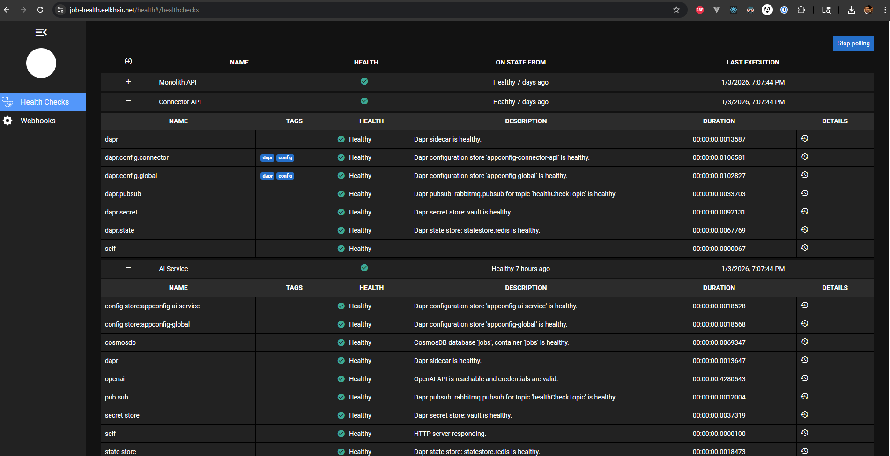
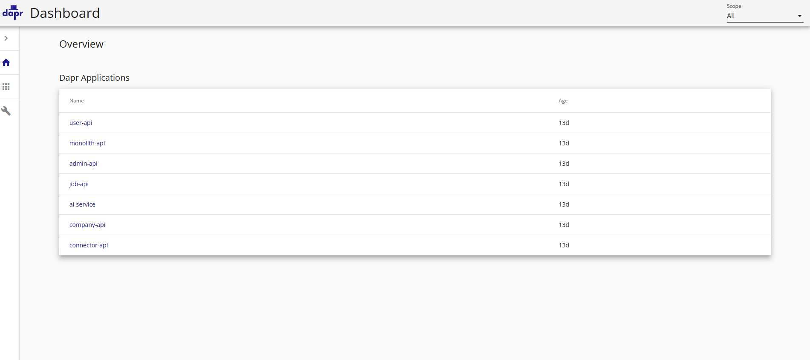

# Health Checks & Runtime Visibility

This project implements **first-class health checks** across the monolith, connector, and microservices to provide **production-grade runtime visibility**.

Health checks are designed to answer the operational questions that matter most in distributed systems:

- Is the service alive?
- Is it ready to serve traffic?
- Are its critical dependencies reachable and healthy?
- Is the distributed runtime (Dapr, messaging, configuration, secrets) functioning correctly?

The goal is not just to detect failures, but to make **partial failures visible and actionable** before they cascade.

---

## High-Level Health Overview

Each service exposes a standardized health endpoint that is aggregated into a **central health UI** built specifically for this platform.

### What this shows
- Monolith API
- Connector API
- Admin API
- Company API
- Job API
- User API
- AI Service

All services report **Healthy**, including timestamps and execution status, allowing operators to quickly validate overall system readiness.

---

## Per-Service Dependency Health

Health checks are **dependency-aware**, not just process checks.

Example from the **Monolith API**:

### Validated dependencies
- Dapr sidecar availability
- Configuration stores
- Pub/Sub broker
- Secret store
- State store
- Database connectivity
- Application self-check

Each dependency is evaluated independently, allowing **partial failures** (e.g., messaging down while HTTP is healthy) to be detected early.

---

## Dapr Runtime Health & Configuration

Local development and production parity rely on Dapr to provide platform abstractions
(state, pub/sub, configuration, secrets).

Health checks validate that **the runtime infrastructure itself** is healthy—not just application code.

### Dapr Component Status

Validated components include:
- Redis state store
- RabbitMQ pub/sub
- Application configuration stores
- Vault secret store
- OAuth middleware

This ensures that failures in infrastructure dependencies surface immediately.

---

## Pub/Sub Subscription Readiness

Health checks verify that required pub/sub subscriptions are registered and active.

This is critical for **outbox-driven integration events**, ensuring that events published by the monolith or services can be consumed end-to-end without silent message loss.

---

## Dapr Application Runtime Summary

Key runtime signals include:
- App ID and application ports
- Dapr HTTP and gRPC endpoints
- Replica count
- Application uptime

This view is especially useful when diagnosing **sidecar vs application** issues in distributed environments.

---

## Dapr Runtime Application Discovery

In addition to HTTP health checks, the platform supports **runtime discovery of all Dapr-enabled applications**.

This capability allows operators to answer:

- Which services are currently running?
- Are all expected Dapr sidecars attached?
- Are application identities (App IDs) registered correctly?
- Has the platform remained stable over time?

### Dapr Dashboard – Application Overview

**Observed applications in this environment:**
- `monolith-api`
- `connector-api`
- `company-api`
- `job-api`
- `user-api`
- `admin-api`
- `ai-service`

Each application is running with an attached Dapr sidecar and has remained healthy for multiple days, indicating **platform stability**, not just transient startup success.

---

## Why This Matters

Distributed systems often fail in **partial and non-obvious ways**:

- Application is running but messaging is broken
- Dapr sidecar is up but configuration is missing
- Database is reachable but credentials are invalid

These health checks make such failures:
- Visible
- Actionable
- Safe to detect early

This reduces **mean time to diagnosis (MTTD)** and prevents cascading failures during partial outages.

---

## Portfolio Intent

This health check strategy demonstrates:

- Operational maturity
- Defensive system design
- Production-readiness thinking
- Experience **operating** distributed systems, not just building them

Health checks are treated as a **first-class platform capability**, not an afterthought.
