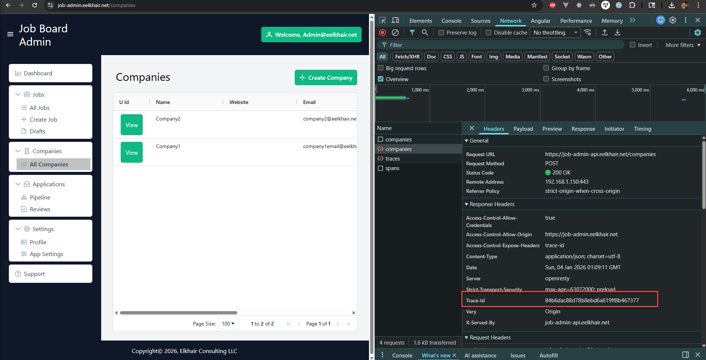
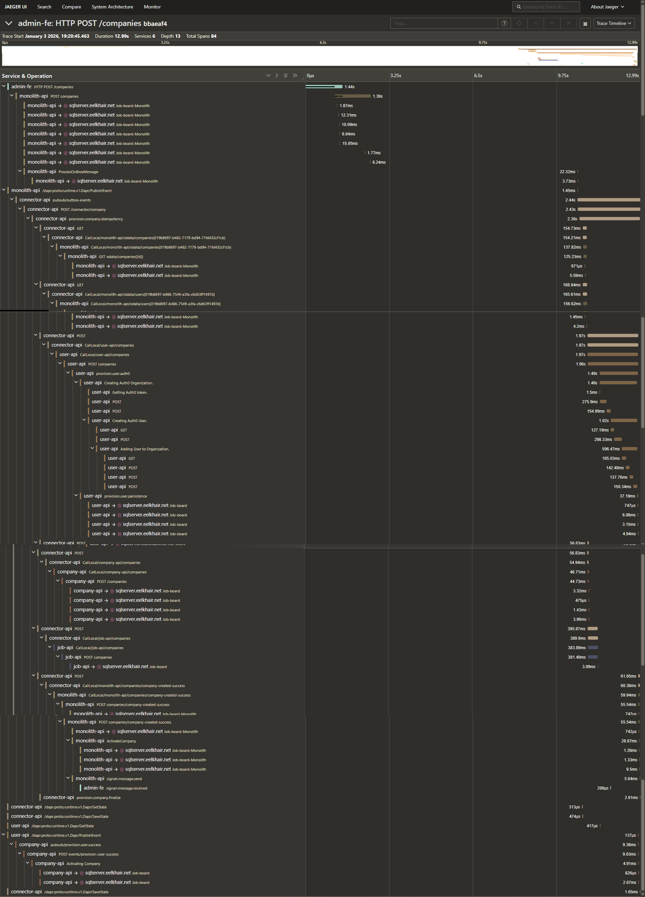

# Observability

This platform is instrumented **end-to-end** using **OpenTelemetry**, with a tracing and logging workflow designed for **real-world debugging**, not demos.

The core idea is simple:

- Every request is traceable from **browser → API → database → async pub/sub → downstream services**
- A single **TraceId** lets you pivot seamlessly between **Jaeger (distributed traces)** and **Grafana (logs and events)**

---

## What’s included

### Distributed tracing (OpenTelemetry)

- HTTP spans for inbound and outbound requests
- Dependency spans (database, external services)
- Pub/Sub spans (publish and consume)
- Rich attributes/tags to make traces searchable and meaningful

### Trace correlation in logs

All logs include trace context, making it possible to:

- Filter logs by `TraceId`
- Group logs by service
- Reconstruct the full story of a request across sync and async boundaries

### “Find by TraceId” in Grafana

A dedicated Grafana workflow allows pasting a **TraceId** and immediately viewing:

- The request path
- The services involved
- Time-ordered logs and events correlated to that trace

---

## Walkthrough: Browser → API → Jaeger → Grafana

### 1) Get the TraceId from the browser

When a request is triggered in the Admin UI, the backend returns a `Trace-Id` response header.  
This makes the TraceId visible immediately to frontend developers and operators.

---

### 2) Follow the trace in Jaeger

Pasting the TraceId into Jaeger shows the **complete distributed trace**, including:

- Service-to-service calls
- Parent/child span relationships
- Latency hotspots and slow dependencies

---

### 3) Pivot to logs and events in Grafana

Using the same TraceId in Grafana allows you to pivot from traces to **correlated logs and events** across all services.

This is especially useful when debugging:
- Partial failures
- Retries
- Async processing delays

---

## Async visibility (Saga + pub/sub)

Asynchronous workflows are fully observable and appear as part of the same request narrative.

This includes:
- Integration events published by the initial request
- Downstream consumers processing those events
- Saga steps logged with ordering and correlation

This allows answering questions like:
- *Which service processed this event?*
- *Did retries occur?*
- *Where did the workflow slow down or fail?*

---

## Recommended conventions

These conventions are intentionally enforced to keep the observability experience consistent and usable:

- **Expose TraceId to the UI** as a response header (`Trace-Id`) and allow it via CORS.
- **Use consistent service names** (e.g. `monolith-api`, `connector-api`, `company-api`).
- Attach **domain-level tags** to spans and logs:
  - Company ID / company name
  - User email
  - Saga ID / idempotency key
- Ensure **retry-aware logging**:
  - Attempt number
  - Message ID
  - Dead-letter routing when applicable

---

## Why this matters

This observability setup makes it possible to:

- Debug production issues quickly
- Understand system behavior across sync and async boundaries
- Reason about performance and reliability using real signals
- Treat observability as a **first-class architectural concern**, not an afterthought

This is the same approach used in production-grade, distributed systems operating at scale.
