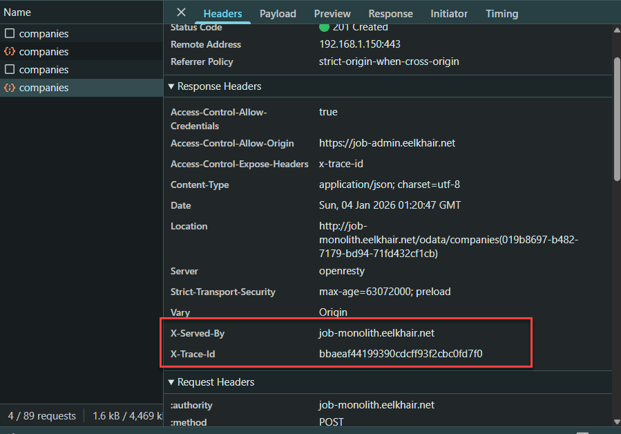
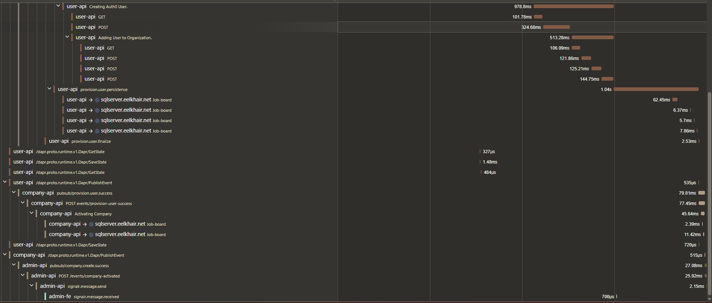
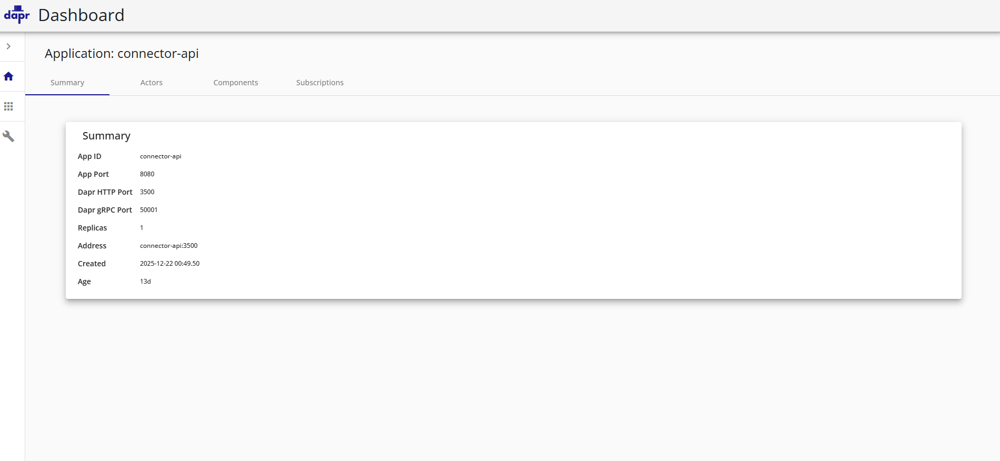
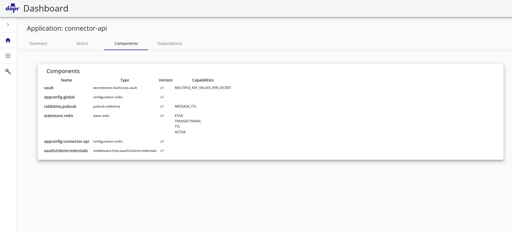
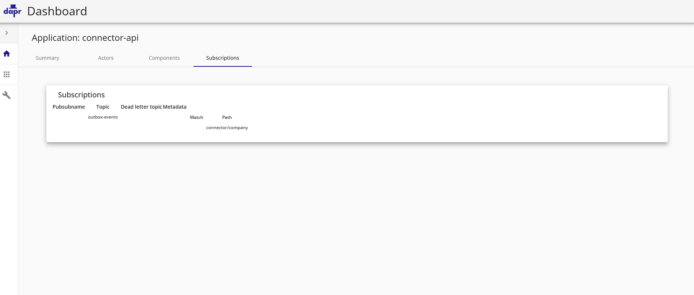
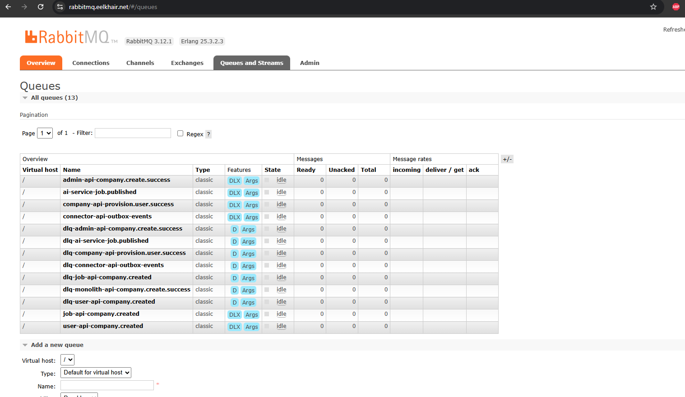
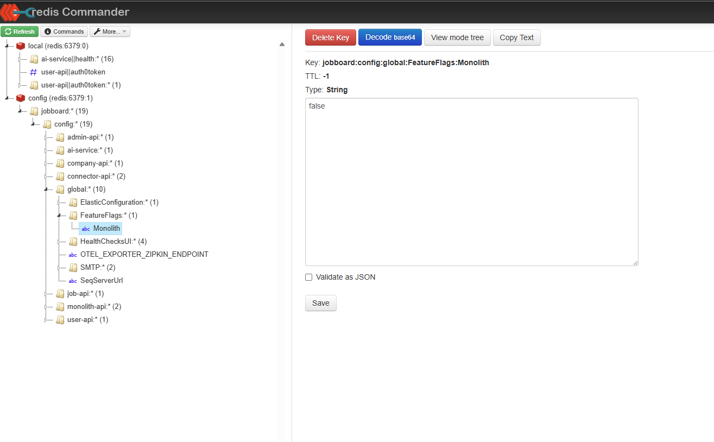

## Screenshots (Curated Evidence)

This repository includes **curated screenshots** to make the architecture and operational story easy to validate **without reading every line of code**.

> **Interview tip:** Walk through a single business flow (e.g. *Create Company → Publish Event → Downstream Processing*) and use these screenshots as proof points.

---

## Observability

### TraceId exposed in the browser

Each request exposes a `Trace-Id` response header, making trace correlation immediately visible to frontend developers and operators.

---

### Trace propagation (browser → backend)

The same TraceId is propagated consistently across services and async boundaries.

---

### End-to-end distributed tracing (Jaeger)

A single TraceId reveals the full request path across services, dependencies, and async workflows.

---

### Logs and events correlated by TraceId (Grafana)

Traces pivot cleanly into logs and events, enabling fast root-cause analysis.

---

### Async saga and pub/sub visibility

Asynchronous workflows (publish/consume + saga steps) appear as part of the same request narrative.

---

## Strangler Fig Migration

These screenshots illustrate the **incremental migration strategy** from monolith to services.

### Stage 1 — Monolith primary

The monolith handles all requests and publishes integration events.

---

### Stage 2 — Connector introduced

A connector layer routes selected flows while preserving backward compatibility.

---

### Stage 3 — Service extraction

Capabilities are extracted into independent services without breaking consumers.

---

### Stage 4 — Deprecated paths

Legacy paths are deprecated and removed once traffic is fully migrated.

---

### Centralized logs and saga sequencing

End-to-end visibility across services during the migration.

---

## Health checks and runtime tooling

These screenshots are captured from a **running environment**, not mocks.

### Central health dashboard

Aggregated health across APIs and critical dependencies.

---

### Dapr runtime dashboard

Runtime visibility into applications, components, and pub/sub subscriptions.

---

### Messaging and configuration infrastructure

Operational views of messaging and configuration state used for runtime diagnostics and troubleshooting.

These dashboards make it easy to answer questions like:
- Are messages backing up?
- Are retries or DLQs involved?
- Which feature flags or config values are currently active?

> Together with tracing and health checks, these views allow fast differentiation
> between application bugs, infrastructure issues, and configuration mistakes.

